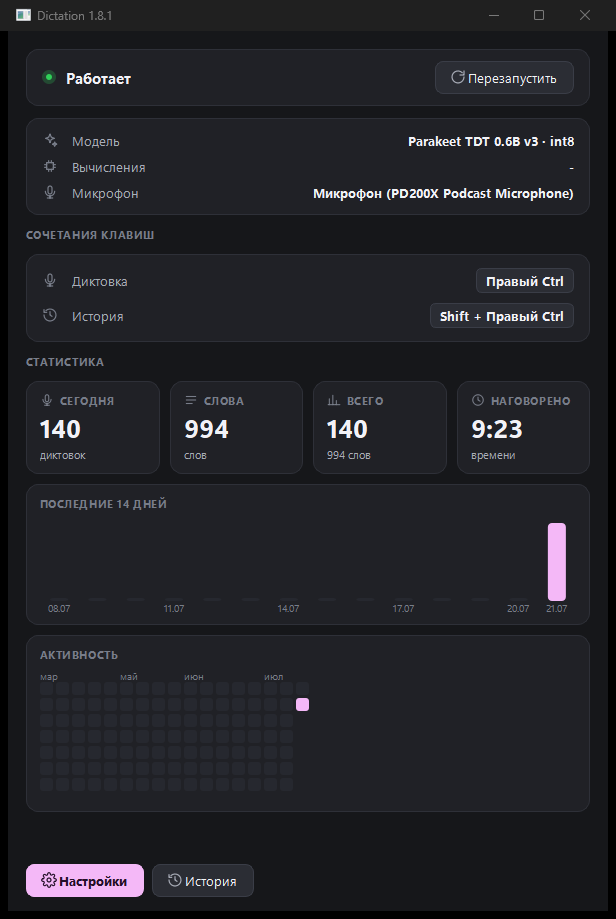
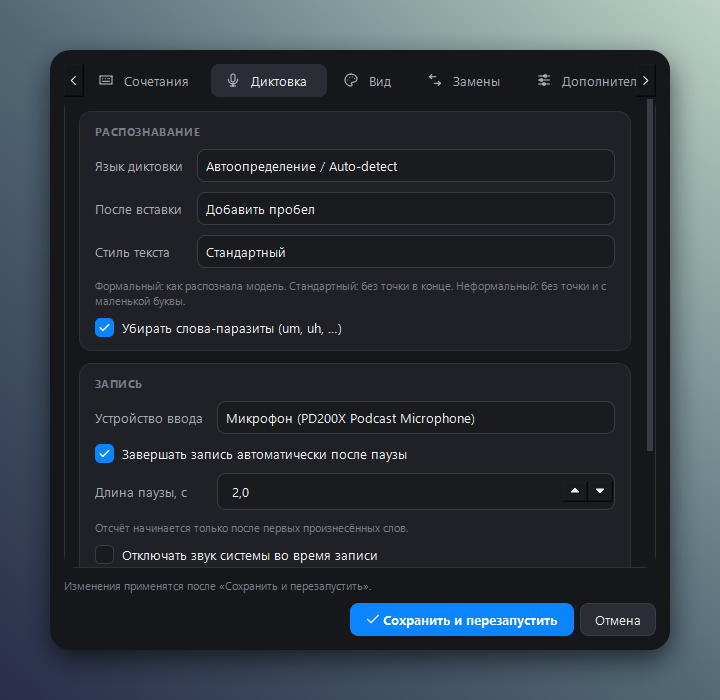

# Dictation для Windows (by Claude Code)

Локальная диктовка по нажатию клавиши: зажали клавишу, сказали, текст
появился в активном поле ввода. 

Порт [shlgd/SuperDictate](https://github.com/shlgd/SuperDictate) (macOS,
Swift), который, в свою очередь, основан на Parakey Ричарда Кортмана.
Модель распознавания та же самая: NVIDIA Parakeet TDT 0.6B v3, 25 языков,
включая русский.



## Установка

**Установщик**: [`Dictation-2.0.2-setup.exe`](https://github.com/metawka/SuperDictate-win/releases/latest)
(~52 МБ). Ставится в профиль пользователя, права администратора не нужны,
в мастере можно сразу включить автозапуск при входе в Windows.

Из исходников:

```powershell
python -m venv .venv
.\.venv\Scripts\pip install -r requirements.txt
.\.venv\Scripts\python main.py
```

Пересобрать `.exe` и установщик:

```powershell
.\build.ps1            # иконка + самотесты + PyInstaller
.\build.ps1 -Clean     # с очисткой build/ и dist/
& "$env:LOCALAPPDATA\Programs\Inno Setup 6\ISCC.exe" installer\Dictation.iss
```

При первом запуске приложение скачивает модель (~640 МБ в int8) в
`%LOCALAPPDATA%\Dictation\Models` с индикатором прогресса.

Требуется Windows 10 1809 или новее, x64.

## Горячие клавиши

| Комбинация | Действие |
| --- | --- |
| **Правый Ctrl** | начать / закончить диктовку |
| **Правый Shift + Правый Ctrl** | история последних расшифровок |
| **Esc** | отменить текущую запись |

Всё меняется в настройках. Режим срабатывания: переключатель (нажал,
начал / нажал, закончил) или удержание.

Модификаторы никогда не перехватываются: Shift остаётся Shift'ом, даже
если он входит в сочетание. Глотается только основная клавиша самого
сочетания и только когда сочетание действительно сработало.

## Функционал

- Распознавание 25 языков, автоопределение или фиксированный язык
- **Стиль текста**: формальный (как выдала модель), стандартный (без
  точки в конце), неформальный (без точки и с маленькой буквы),
  разговорный (совсем без заглавных, кроме аббревиатур; точки внутри
  превращаются в запятые, так что реплика идёт одной строкой)
- **Автозавершение записи по тишине**: включается галочкой, длина паузы
  настраивается (1-10 с, по умолчанию 2.5 с). Отсчёт начинается только
  после первых произнесённых слов, поэтому пауза перед началом речи
  запись не обрывает.
- **Числа цифрами** (по умолчанию включено): «двадцать три» -> «23»,
  «сто двадцать три» -> «123». Разбираются числа до 999 в именительном
  падеже; косвенные («из двух часов») остаются словами
- Словарь замен: свои пары «слышится как» -> «заменить на», с учётом
  границ слов. Изначально пуст
- Удаление слов-паразитов с восстановлением пунктуации и заглавных
- Статистика: плитки за сегодня и за всё время, столбцы за 14 дней и
  тепловая карта активности за 17 недель
- Приглушение системного звука на время записи
- **Пауза воспроизведения**: в начале записи нажимается медиаклавиша
  «пауза», в конце — ещё раз, так что видео или трек продолжаются с того
  же места. Клавиша — переключатель, поэтому сначала проверяется, играет
  ли что-нибудь: если нет, нажатия не будет и запись ничего не включит
- Свои короткие сигналы начала и конца записи (второй - тот же звук
  наоборот), не системные звуки Windows
- HUD-капсула с индикатором громкости. Цвета записи и расшифровки
  выбираются вручную, в том числе градиентом
- **Расшифровка на ходу**: над капсулой вторая, поменьше, с текстом по
  мере речи. Модель не потоковая, поэтому запись переслушивается целиком
  раз в 1-5 с (интервал растёт с длиной), и уже показанные слова могут
  переписаться; окончательный текст всегда распознаётся заново после
  остановки. Читается только последние 30 с, и на предпросмотр отводится
  половина одного ядра, иначе проход стоил бы дороже паузы между проходами.
  Пузырёк появляется лёгким «раскрытием» и растягивается вместе с фразой.
  Уходит он одновременно с капсулой, и включённый предпросмотр не держит
  HUD на экране дольше, чем выключенный
- **Пояснения по наведению**: подписи под настройками убраны, вместо них у
  строки стоит знак вопроса. У стиля текста описывается только выбранный
  стиль, а не все четыре сразу
- **Уведомления по адресу**: сбои оборудования (нет доступа к микрофону,
  микрофон занят, не удалось поставить перехват клавиатуры) уходят в Центр
  уведомлений Windows и ждут там. Неудачная диктовка (слишком короткая
  запись, речь не распознана) показывается прямо на капсуле: вместо
  полосок появляется значок, при наведении на него причина выводится там
  же, где идёт предпросмотр текста
- Восстановление незавершённой записи после падения (попадает в историю, не вставляется автоматически)
- Автозапуск при входе в систему
- Проверка обновлений (настройки, вкладка «Дополнительно»)



## Микрофон

Список устройств в настройках, вкладка «Диктовка». Любой микрофон
записывается на его собственной частоте дискретизации и приводится к
16 кГц уже внутри приложения (окно Ханна, КИХ-фильтр против алиасинга).
WASAPI в общем режиме принимает только родную частоту устройства, поэтому
попытка открыть его сразу на 16 кГц заканчивалась ошибкой, а показывалась
она как «нет доступа к микрофону», хотя доступ был.

## Данные

Всё находится в `%LOCALAPPDATA%\Dictation`.

| Файл | Что это |
| --- | --- |
| `Settings.json` | настройки |
| `History.json` | последние 200 расшифровок |
| `Usage.json` | статистика за 400 дней |
| `Corrections.json` | словарь замен |
| `Models\` | скачанная модель |
| `Cache\` | иконки интерфейса |
| `Logs\Dictation.log` | лог (2 МБ x 3) |

Программа называлась D1CT (1.5.0-1.8.2) и SuperDictate (до 1.5.0). Папки
с данными от прежних имён переносятся при первом запуске, поэтому модель
не скачивается заново и история не теряется.

Переменная `DICTATION_HOME` переопределяет корень. При удалении программы
установщик спрашивает, стирать ли эту папку; если ответить «нет», модель
не придётся качать заново.

## Производительность

На CPU (int8) распознавание идёт примерно в 10 раз быстрее реального
времени: 3.7 с речи за 0.33 с. Загрузка модели ~3 с при старте.

### Запуск на видеокарте

Установщик идёт с CPU-версией `onnxruntime` и весит 52 МБ. GPU-версия
тянет за собой библиотеки NVIDIA примерно на 2,5 ГБ, поэтому в установщик
она не входит: выигрыш (0,33 с против ~0,1 с на трёх секундах речи)
меньше, чем задержка, которую вообще можно заметить, а на не-NVIDIA
машинах эти гигабайты просто лежали бы мёртвым грузом.

Кому это всё же нужно — ставится из исходников одной заменой пакета:

```powershell
python -m venv .venv
.\.venv\Scripts\pip install -r requirements.txt
.\.venv\Scripts\pip uninstall -y onnxruntime
.\.venv\Scripts\pip install onnxruntime-gpu
.\.venv\Scripts\python main.py
```

Дополнительно нужны CUDA Toolkit 12.x и cuDNN 9 от NVIDIA, видеокарта —
любая с поддержкой CUDA. Код менять не нужно: настройка «вычислитель»
(`auto` / `cuda` / `cpu`) уже есть в интерфейсе, `auto` берёт видеокарту,
если провайдер загрузился, и молча откатывается на процессор, если нет.
Что получилось в итоге, видно в панели управления в строке «Вычисления» и
в настройках, вкладка «Дополнительно».

## Отличия от macOS-версии

Порт не буквальный: CoreML, CGEventTap, TCC и LaunchAgent заменены
виндовыми механизмами (ONNX Runtime, низкоуровневый хук клавиатуры,
запись в `HKCU\...\Run`, именованный мьютекс). Поведение сохранено, но
есть осознанные пробелы:

- **Подсказка языка не влияет на декодер.** В macOS FluidAudio фильтрует
  декодер по набору символов языка; в `onnx-asr` параметр `language`
  работает только для Whisper и Canary, не для Parakeet TDT. Настройка
  языка диктовки поэтому влияет только на починку `<unk>` в ё.
- HUD не следует за курсором ввода. macOS-версия ставит капсулу рядом с
  текстовой кареткой, но на Windows её положение сообщают далеко не все
  приложения (поля паролей, Chromium, всё, что рисует каретку само), и
  капсула прыгала. Она всегда снизу по центру.

## Проверка

```powershell
.\.venv\Scripts\python main.py --self-test
```

16 тестов на чистой логике: конечный автомат горячих клавиш (включая
проверку, что модификаторы не перехватываются), обработка текста и стили,
сериализация настроек. Микрофон, хук и модель не задействованы, так что
тесты идут и без оборудования.

## Лицензия

MIT, как у оригинала, см. [LICENSE](LICENSE) и [NOTICE.md](NOTICE.md).
Авторство: [shlgd/SuperDictate](https://github.com/shlgd/SuperDictate),
Parakey (Richard Courtman), модель Parakeet TDT v3 (NVIDIA), ONNX-сборка
[istupakov](https://huggingface.co/istupakov/parakeet-tdt-0.6b-v3-onnx).
